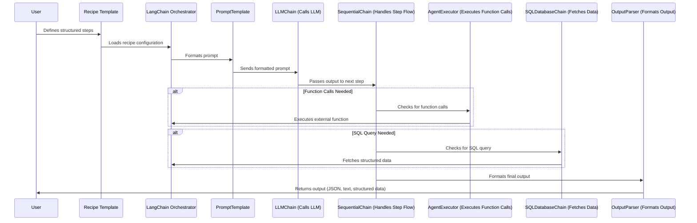

# LangChain Recipe-Based Bot

## Overview
This project implements a **recipe-based prompt chaining system** using **LangChain**. It allows users to define structured workflows where each step involves sending prompts to an LLM, executing function calls, querying databases, and formatting the output.

## Features
- **Configurable Recipes:** Steps are defined in YAML configuration files.
- **Prompt Chaining:** Uses `LLMChain`, `SequentialChain`, and `PromptTemplate` to manage prompt execution.
- **Function Calls & Agents:** Supports external API calls via `AgentExecutor`.
- **SQL Database Integration:** Queries structured data using `SQLDatabaseChain`.
- **Flexible Output Formats:** JSON, structured text, or free-form responses.
- **Modular & Scalable:** Easily extendable architecture for new features.

## Project Structure
```
langchain-recipe-bot/
│── configs/
│   ├── recipe_example.yaml
│   ├── agent_config.yaml
│   ├── db_config.yaml
│
│── prompts/
│   ├── step1_prompt.txt
│   ├── step2_sql_query.txt
│   ├── step3_summary_template.txt
│
│── chains/
│   ├── prompt_chain.py
│   ├── agent_chain.py
│   ├── sql_chain.py
│   ├── sequential_chain.py
│
│── agents/
│   ├── function_calls.py
│   ├── agent_executor.py
│
│── database/
│   ├── db_connection.py
│   ├── query_handler.py
│
│── utils/
│   ├── output_parser.py
│   ├── config_loader.py
│
│── main.py
│── requirements.txt
│── README.md
│── .env
```

## How It Works
1. The **user selects a recipe** (`recipe_example.yaml`).
2. `main.py` **reads the recipe** and initializes the chains.
3. The **first step’s prompt** is retrieved from `prompts/`.
4. If a **database query** is required, it runs via `sql_chain.py`.
5. If a **function call** is required, `agent_executor.py` processes it.
6. `sequential_chain.py` ensures data flows between steps.
7. The **final result** is formatted by `output_parser.py` and returned.

## Installation
1. Clone the repository:
   ```sh
   git clone https://github.com/your-repo/langchain-recipe-bot.git
   cd langchain-recipe-bot
   ```
2. Install dependencies:
   ```sh
   pip install -r requirements.txt
   ```
3. Set up environment variables:
   ```sh
   cp .env.example .env
   ```
4. Run the main script:
   ```sh
   python main.py
   ```

## Sequence Diagram

