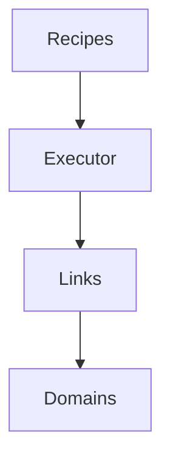
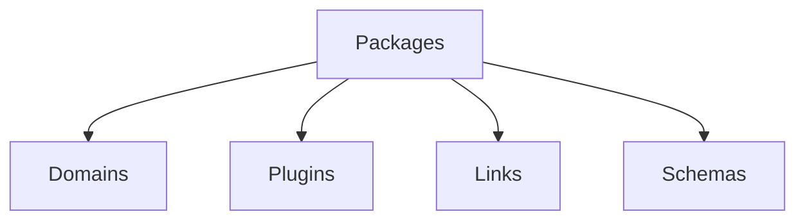

# Hottopoteto Architecture

This document describes the high-level architecture of Hottopoteto, including key components and their relationships.

## System Overview

Hottopoteto uses a modular architecture with the following main components:



## Core Components

### **Recipes**
Recipes are declarative **YAML** files that define a sequence of operations. They specify:

- **Links to execute**
- **Configuration** for each link
- **Input/output schemas**
- **Connections between links** from different domains

#### **Example recipe structure:**
```yaml
name: "Example Recipe"
description: "Description of what this recipe does"
version: "1.0"
links:
  - name: "Link_1"
    type: "domain_a.link_type"
    # link-specific configuration
  - name: "Link_2"
    type: "domain_b.another_link_type"
    # link-specific configuration
```

### **Executor**
The **RecipeExecutor** processes recipes by:

- **Loading** the recipe definition
- **Executing each link** in sequence
- **Maintaining a memory context** for passing data between links
- **Handling errors and exceptions**
- **Returning the final output**

### **Links**
Links are the basic units of execution in recipes. Each link:

- Has a **specific type** (e.g., `llm`, `user_input`, `function`)
- Takes **inputs** from previous links or direct configuration
- Produces **outputs** that can be used by subsequent links
- Is **registered** by either the core system or plugins
- Can **handle its own storage needs** when necessary
- May belong to a specific **domain**

### **Domains**
Domains represent specialized knowledge areas with their own models, schemas, and utilities. They provide:

- **Standard schemas** for domain-specific data
- **Processing functions** for domain objects
- **CLI commands** for domain operations
- **Domain-specific utilities**
- **Links** specific to the domain's functionality

### **Plugins**
Plugins extend functionality by adding new link types and other capabilities. Each plugin:

- Registers **one or more link types**
- Provides **schemas** for its link configurations
- May support **specific domains**
- Has its own **requirements and dependencies**

### **Packages**
Packages extend Hottopoteto with new domains, plugins, and other components:

- **Installable**: Using standard Python packaging
- **Discoverable**: Via entry points
- **Self-registering**: Components register with appropriate registries
- **Modular**: Can include domains, plugins, schemas, and more



### **Storage**
Storage in Hottopoteto is handled at the link level:

- Each link can perform its own storage operations
- Links can write to the output folder as needed
- The `storage` domain provides models and links that act as storage adapters
- Common storage adapters available include:
  - **File storage**
  - **SQLite**
  - **MongoDB**
  - **Custom adapters**

## System Interactions

1. A recipe is loaded by the **RecipeExecutor**
2. The executor processes **each link** in sequence
3. Links may use **domain utilities** for specialized operations
4. Links may perform **storage operations** when needed
5. Plugins provide additional **link types and capabilities**

## Directory Structure

```
hottopoteto/
├── core/                  # Core system components
│   ├── domains.py         # Domain registry
│   ├── executor.py        # Recipe executor
│   ├── links/             # Link base classes
│   └── schemas/           # Schema registry
├── domains/               # Domain implementations
│   ├── conlang/           # Example domain: constructed languages
│   └── storage/           # Storage adapters implemented as links
├── plugins/               # Plugin implementations
│   ├── gemini/            # Google Gemini plugin
│   ├── mongodb/           # MongoDB plugin
│   └── sqlite/            # SQLite plugin
├── utils/                 # Utility functions
│   └── package_template.py # Package template generator
├── cli/                   # Command-line interfaces
│   └── commands/          # CLI command implementations
├── recipes/               # Recipe definitions
│   ├── examples/          # Example recipes
│   └── conlang/           # Domain-specific recipes
└── main.py                # Command-line interface
```

## Extension Points

Hottopoteto is designed to be extended through several mechanisms:

- **New Domains**: Create new domains by extending the domain system
- **New Plugins**: Create new plugins to add link types and capabilities
- **New Storage Links**: Create new links for the storage domain for different backends
- **Custom Link Types**: Register new link types for specialized tasks
- **Recipe Templates**: Create reusable recipe templates for common patterns
- **Packages**: Distribute extensions as installable packages

## Data Flow

1. **Input**: Recipe definition loaded from YAML/JSON
2. **Processing**: Links executed in sequence, with data passed through memory context
3. **Storage**: Individual links perform storage operations as needed
4. **Output**: Final results returned to the caller

## Error Handling

The system includes several levels of error handling:

- **Schema Validation**: Ensures input data conforms to schemas
- **Link Execution**: Catches and reports errors during link execution
- **Storage Operations**: Links handle their own storage errors
- **CLI Interface**: Provides clear error messages to users

## Security Considerations

- **Code Execution**: Function links use a restricted execution environment
- **Data Validation**: Schema validation prevents malformed data
- **Resource Limits**: Controls for API usage and resource consumption
- **Error Messages**: Careful handling to prevent information leakage
