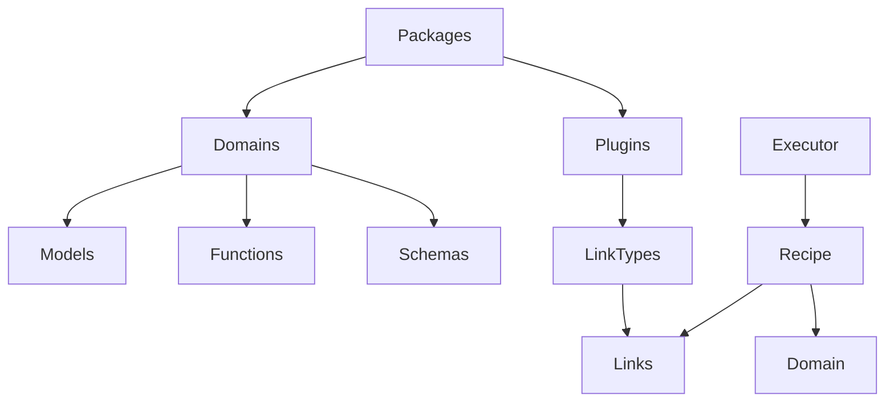

# Component Relationships in Hottopoteto

This document explains how the key components in Hottopoteto relate to each other.

## Component Hierarchy



## Key Relationships

### Packages and Domains

- **A package can implement multiple domains**
  - Example: A linguistics package might implement both `phonology` and `syntax` domains
- **A domain can be implemented by multiple packages**
  - Example: The `llm` domain might be implemented by both core and specialized packages

### Packages and Plugins

- **A package can provide multiple plugins**
  - Example: A database package might provide plugins for MongoDB, PostgreSQL, etc.
- **Plugins are always part of a package**
  - Every plugin belongs to exactly one package that registered it

### Domains and Schemas

- **Domains define standard schemas for their data models**
  - These schemas ensure consistency across different implementations
- **Domain-specific schemas follow the pattern: `{domain_name}.{schema_name}`**
  - Example: `llm.message` for message schema in the LLM domain

### Plugins and Link Types

- **Plugins typically register one or more link types**
  - Example: A storage plugin might register `storage.save`, `storage.query`, etc.
- **Link type names follow the pattern: `{plugin_name}.{operation}`**
  - Exception: Core link types may have simple names like `llm`, `function`

## Registration Flow

1. **Package Registration**:
   ```python
   PackageRegistry.register_package("my_package", __name__)
   ```

2. **Domain Registration**:
   ```python
   register_domain_interface("my_domain", {...})
   PackageRegistry.register_domain_from_package("my_package", "my_domain", __name__)
   ```

3. **Plugin Registration**:
   ```python
   PackageRegistry.register_plugin_from_package("my_package", "my_plugin", __name__)
   ```

4. **Link Type Registration**:
   ```python
   register_link_type("my_plugin.operation", MyLinkHandler)
   ```

## Discovery Mechanism

During startup, Hottopoteto:

1. Registers the core package
2. Discovers other packages via entry points
3. Each package registers its domains, plugins, and link types
4. This builds a complete registry of available functionality

This system allows for a flexible and extensible architecture where components can be mixed and matched as needed.
