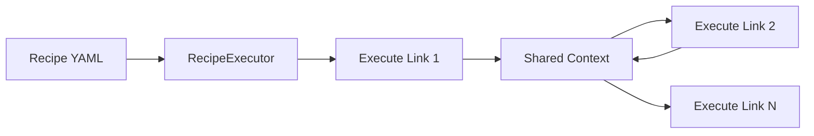

# Recipe System in Hottopoteto

This document explains how recipes work in Hottopoteto, including their execution process.

## What Are Recipes?

Recipes are YAML files that define a sequence of operations (links) to execute. They serve as the primary way to orchestrate functionality in Hottopoteto.

## Recipe Structure

A recipe includes:

- **Metadata**: Name, description, version, etc.
- **Links**: Sequence of operations to execute
- **Schemas**: Optional data validation rules

Here's a simple example:

```yaml
name: "Hello World Recipe"
description: "A simple example recipe"
version: "1.0"
links:
  - name: "User_Input"
    type: "user_input"
    description: "Get user name"
    inputs:
      name:
        type: "string"
        description: "Your name"
    
  - name: "Greeting"
    type: "llm"
    model: "gpt-4o"
    prompt: "Write a greeting for {{ User_Input.data.name }}."
```

## Execution Flow

When a recipe is executed, the following steps occur:

1. **Loading**: The recipe file is loaded and parsed
2. **Initialization**: The executor creates a memory context
3. **Link Execution**: Links are executed in sequence
4. **Context Building**: Each link's output is added to the memory context
5. **Data Flow**: Links can access previous links' outputs via template references



## Schema Processing

During execution, the system processes schema references:

1. **Schema References** (`$ref`) are resolved to concrete schemas
2. **Schema Extensions** (`base`) are extended with additional properties
3. **Schema Validation** (`_validate_against`) is applied to verify outputs

## Output Structure

Each link produces a standardized output with:

- **raw**: The raw, unprocessed output (e.g., text from an LLM)
- **data**: Structured data conforming to the output schema

## Recipe Variables

Recipes can use variables in templates using `{{ variable }}` syntax:

- **Link references**: `{{ Link_Name.data.field }}`
- **Context references**: `{{ context_variable }}`
- **Functions**: `{{ now() }}`, `{{ random() }}`

## Conversation Management

LLM links support conversation management:

- `conversation: "none"` - No conversation history (default)
- `conversation: "default"` - Use the default conversation
- `conversation: "custom_name"` - Use a named conversation

Conversation history is maintained between links that use the same conversation name.

## Error Handling

Recipes can include error handling mechanisms:

- **Conditions**: Skip links based on conditions
- **Try/Catch**: Continue execution after errors
- **Validation**: Validate outputs against schemas

## Purpose of Recipes

Remember that recipes are not functions that return values, but rather:

1. Configurations of commands to execute
2. Workflows that connect different operations
3. Declarative descriptions of processes
4. A way to chain together operations with data flowing between them

The execution happens for its side effects (generating text, storing data, making API calls, etc.), not to produce a return value for external code.

For detailed information about recipe format, see the [Recipe Format Reference](../reference/recipe-format.md).
