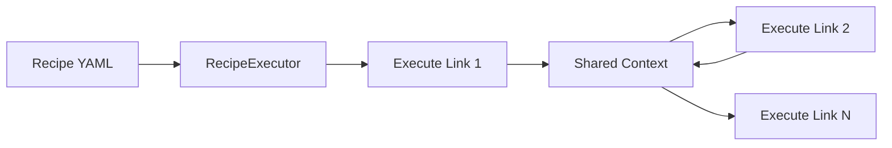

# Recipe Execution in Hottopoteto

This document explains how recipes are executed and how data flows between links.

## What are Recipes?

Recipes are configuration files that define a sequence of operations (links) to be executed. They are not functions that return values, but rather declarations of commands to run in a specific order.

## Recipe Execution Process

When a recipe is executed:

1. The `RecipeExecutor` loads the recipe definition
2. Links are executed in sequence
3. Each link has access to outputs from previous links via a shared context
4. Links can use this context to inform their behavior
5. The final state is the execution of all links in sequence



## Shared Context

During execution, links communicate through a shared context:

- Each link's output is stored in the context under its name
- Subsequent links can access this information
- Context persists only during recipe execution
- The context is not returned as a "result" - it's an internal implementation detail

## Link Output Structure

Each link produces output with two main components:

1. **`raw`**: The unprocessed output string from the operation
2. **`data`**: Structured data extracted according to schema (if provided)

These outputs are stored in context for use by subsequent links.

## Accessing Previous Link Outputs

Links can reference outputs from previous links using Jinja templates:

```yaml
links:
  - name: "First_Link"
    type: "user_input"
    # ...configuration...
  
  - name: "Second_Link"
    type: "llm"
    # ...configuration...
    prompt: "Process this information: {{ First_Link.data.some_field }}"
```

## Link Types and Their Behavior

### LLM Link

```yaml
- name: "Generate_Description"
  type: "llm"
  model: "gpt-4o"
  prompt: "Create a description for {{ Product_Info.data.name }}"
  # The output will be available as Generate_Description.raw and Generate_Description.data
```

### Function Link

```yaml
- name: "Calculate_Price"
  type: "function"
  function:
    name: "calculate_total_price"
  inputs:
    base_price: "{{ Product_Info.data.price }}"
    tax_rate: 0.08
  # The output will be available as Calculate_Price.data
```

### User Input Link

```yaml
- name: "User_Input"
  type: "user_input"
  inputs:
    name:
      type: "string"
      description: "Enter your name"
  # The output will be available as User_Input.data.name
```

## Special Context Values

During recipe execution, some special values are available in the context:

- `__conversations`: Contains conversation history for LLM links with conversation mode
- `__global`: Can store global variables accessible across all links

## Error Handling

If a link fails during execution, the error is stored in the context:

```yaml
- name: "Handle_Error"
  type: "function"
  condition: "{{ Previous_Link.data.error != null }}"
  function:
    name: "log_error"
  inputs:
    error_message: "{{ Previous_Link.data.error }}"
```

## Purpose of Recipes

Remember that recipes are not functions that return values, but rather:

1. Configurations of commands to execute
2. Workflows that connect different operations
3. Declarative descriptions of processes
4. A way to chain together operations with data flowing between them

The execution happens for its side effects (generating text, storing data, making API calls, etc.), not to produce a return value for external code.
