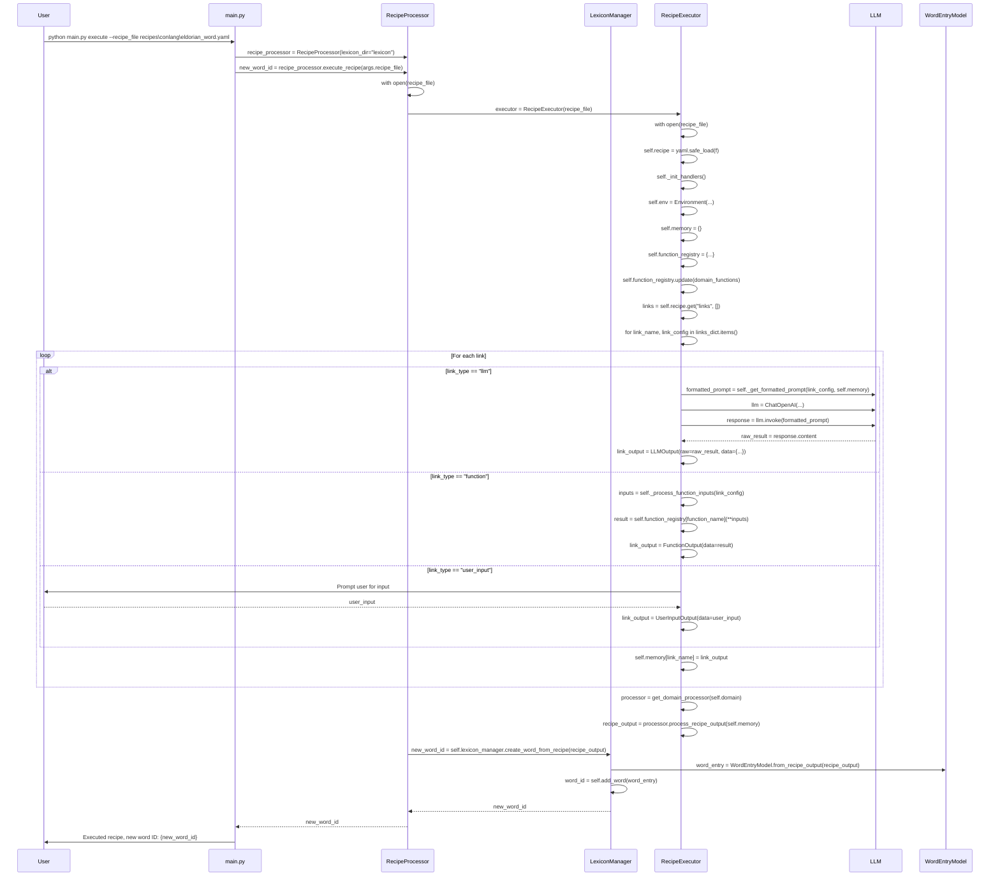

# Key Functions in Recipe Execution Flow

This document outlines the key functions involved in the `execute` command flow, providing a description of their purpose, inputs, and outputs.

## 1. `main` (lexicon/main.py)

*   **Purpose:** Entry point for the CLI application. Handles command-line argument parsing and calls the appropriate functions based on the command.
*   **Inputs:**
    *   `args`: Parsed command-line arguments (e.g., `recipe_file`, `origin_language`, `part_of_speech`).
*   **Outputs:**
    *   Prints messages to the console indicating the success or failure of the command.
    *   Calls other functions to perform the requested action.

## 2. `LexiconManager.create_word_from_recipe` (lexicon/manager.py)

*   **Purpose:** Creates a word entry from the output of a recipe and adds it to the lexicon.
*   **Inputs:**
    *   `recipe_output`: A dictionary containing the output of the recipe execution.
*   **Outputs:**
    *   `word_id`: The ID of the newly created word.

## 3. `WordEntryModel.from_recipe_output` (lexicon/models/word.py)

*   **Purpose:** Transforms the recipe output into a `WordEntryModel` instance.
*   **Inputs:**
    *   `recipe_output`: A dictionary containing the output of the recipe execution.
*   **Outputs:**
    *   `word_entry`: An instance of `WordEntryModel` representing the new word.

## 4. `LexiconManager.add_word` (lexicon/manager.py)

*   **Purpose:** Adds a word to the lexicon, performing schema validation and indexing.
*   **Inputs:**
    *   `word_entry`: A dictionary or `WordEntryModel` instance representing the word to be added.
    *   `validate`: A boolean indicating whether to perform schema validation.
*   **Outputs:**
    *   `word_id`: The ID of the newly added word.

## 5. `RecipeExecutor.execute` (core/executor.py)

*   **Purpose:** Executes the recipe step-by-step, collecting user input and generating the final output.
*   **Inputs:**
    *   `recipe_file`: The path to the YAML or JSON recipe file.
*   **Outputs:**
    *   `recipe_output`: A dictionary containing the output of each step in the recipe.

## 6. `DomainProcessor.process_recipe_output` (domains/conlang/\_\_init\_\_.py)

*   **Purpose:** Processes the recipe output into a format suitable for creating a word entry.
*   **Inputs:**
    *   `recipe_output`: A dictionary containing the output of the recipe execution.
*   **Outputs:**
    *   `word_entry`: A dictionary or `WordEntryModel` instance representing the new word.

