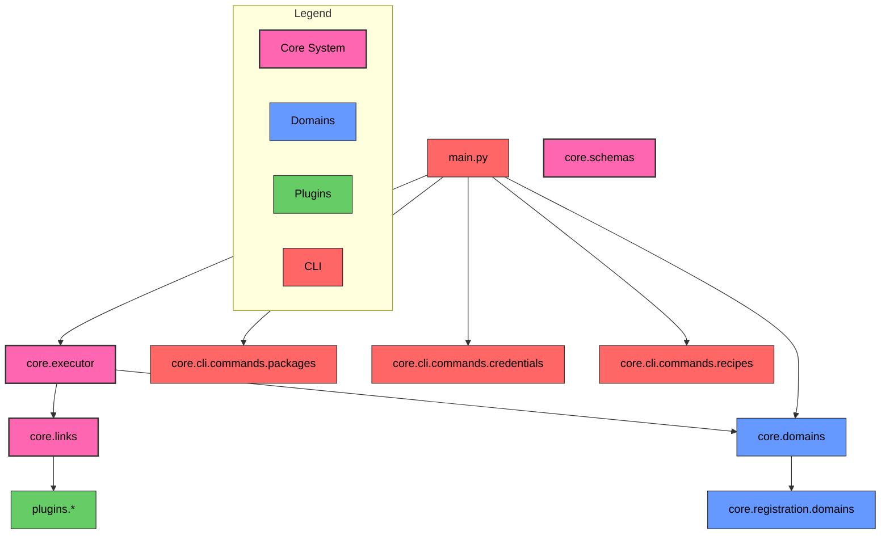
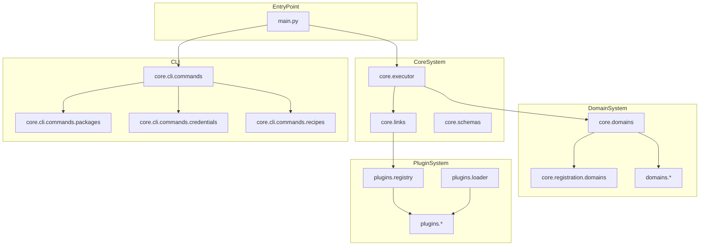
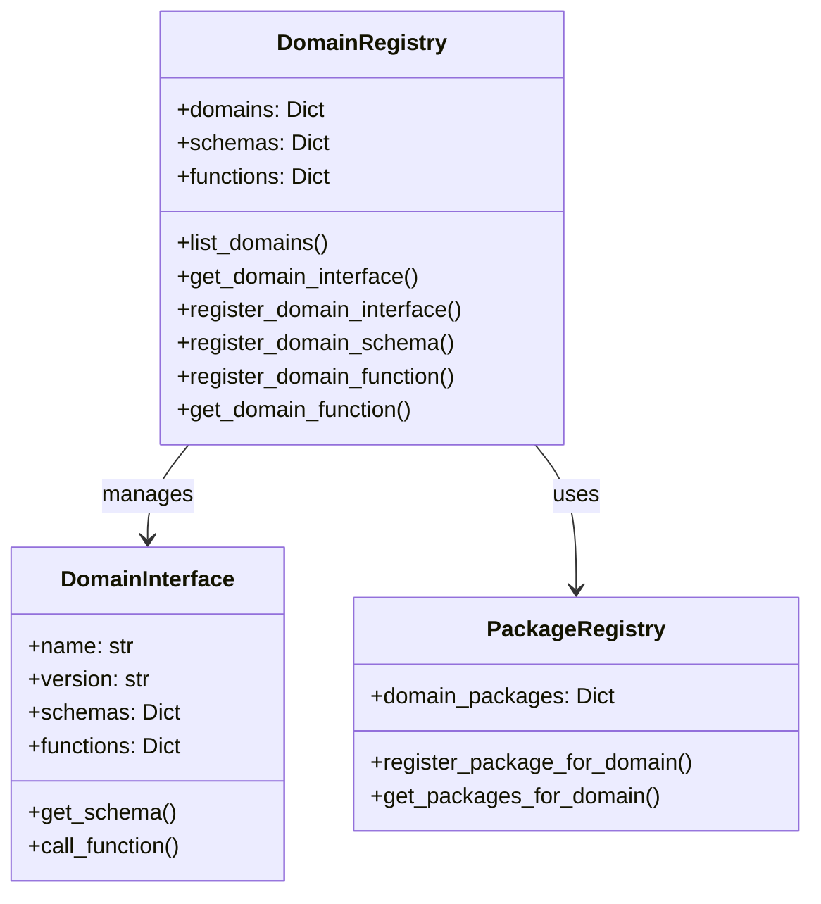
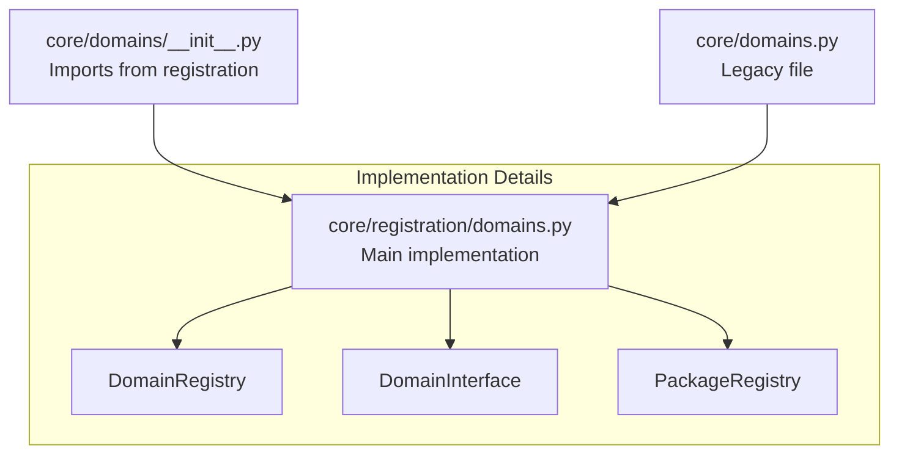
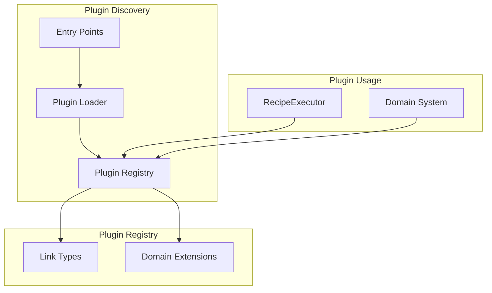

# Code Structure Technical Reference

This document provides a detailed technical reference of Hottopoteto's code organization and implementation details, serving as a developer companion to the [high-level architecture overview](../concepts/architecture.md).

## System Implementation Map

The following diagram shows how the conceptual architecture is implemented across files and modules:



## Module Dependency Graph



## Component Details

### Execution Flow

```mermaid
sequenceDiagram
    participant User
    participant CLI as CLI Interface
    participant Executor as RecipeExecutor
    participant Links as Link System
    participant Domains as Domain System
    participant Storage as Storage System
    
    User->>CLI: Run recipe command
    CLI->>Executor: Load and execute recipe
    
    loop For each link in recipe
        Executor->>Links: Execute link
        Links->>Domains: Use domain functions (if needed)
        Links->>Storage: Store data (if needed)
        Links-->>Executor: Return link result
    end
    
    Executor-->>CLI: Return final result
    CLI-->>User: Display output
```

### main.py
Entry point containing:
- `core.executor.RecipeExecutor`
- CLI command handlers for packages and credentials
- Domain management functionality

### core.cli.commands.packages
Package management commands:
- `packages_group`
- `list_packages`
- `install_package`
- `uninstall_package`
- `create_package`

### core.cli.commands.credentials
Credential management commands:
- `add_credentials_command`
- `handle_credentials_command`

### Domain Management System



The domain management functionality is implemented across several files:



#### Domain Management Functions

The following functions are available for domain management:

| Function | Description |
|----------|-------------|
| `list_domains` | Returns a list of all registered domains |
| `get_domain_interface` | Retrieves interface for a specific domain |
| `get_packages_for_domain` | Lists packages registered for a domain |
| `register_domain_interface` | Registers a new domain interface |
| `register_package_for_domain` | Associates a package with a domain |
| `register_domain_schema` | Registers a schema for a domain |
| `register_domain_function` | Registers a function for a domain |
| `get_domain_function` | Retrieves a function registered for a domain |

## Plugin System Architecture



## File Structure

- **main.py**: Project entry point
- **core/domains/__init__.py**: Domain system entry point, imports from registration
- **core/domains.py**: Legacy file that redirects to registration (consider deprecating)
- **core/registration/domains.py**: Core implementation of domain management system

## Relationship to Architecture Concepts

This section maps the code modules to the architectural concepts described in the [architecture overview](../concepts/architecture.md):

| Architecture Concept | Implementation Modules |
|----------------------|------------------------|
| Recipes | Defined as YAML files, loaded by `core.executor` |
| Executor | `core.executor.RecipeExecutor` |
| Links | `core.links.*` |
| Domains | `core.domains` and `core.registration.domains` |
| Plugins | Discovered and loaded via package system |

## Using This Reference

This document is intended for:
- Developers extending the system
- Contributors to the core codebase
- Users creating custom packages or plugins

For high-level understanding, please refer to the [architecture overview](../concepts/architecture.md).