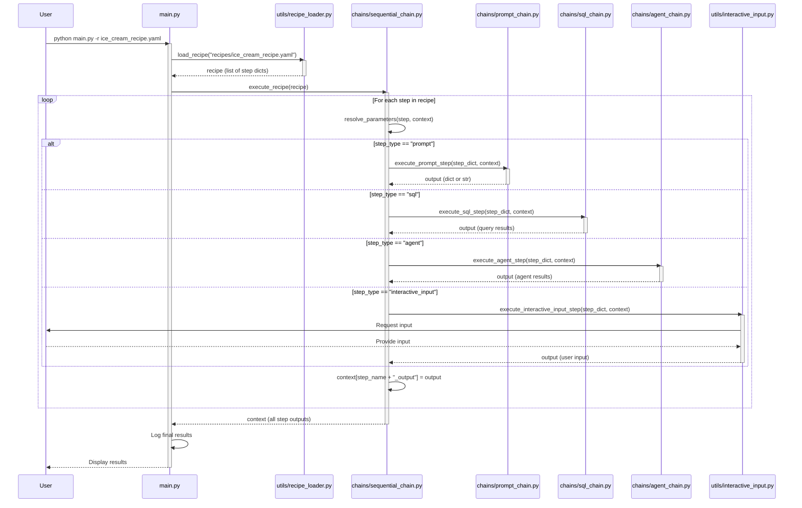

# Recipe Execution Sequence Diagram

## Flow Explanation

1. **User Initiates**: The user runs the application with a recipe file argument.
2. **Recipe Loading**: `main.py` calls `load_recipe()` to parse the YAML file into a list of step dictionaries.
3. **Recipe Execution**: The parsed recipe is passed to `execute_recipe()` in `sequential_chain.py`.
4. **Step Processing Loop**: For each step in the recipe:
   - **Parameter Resolution**: Placeholders like `{{previous_step_output.field}}` are replaced with actual values.
   - **Step Type Selection**: Based on the step type, the appropriate execution function is called.
   - **Context Update**: The output of each step is stored in the context dictionary with the key `{step_name}_output`.
5. **Final Results**: After all steps are executed, the complete context is returned to `main.py` which logs the results.
