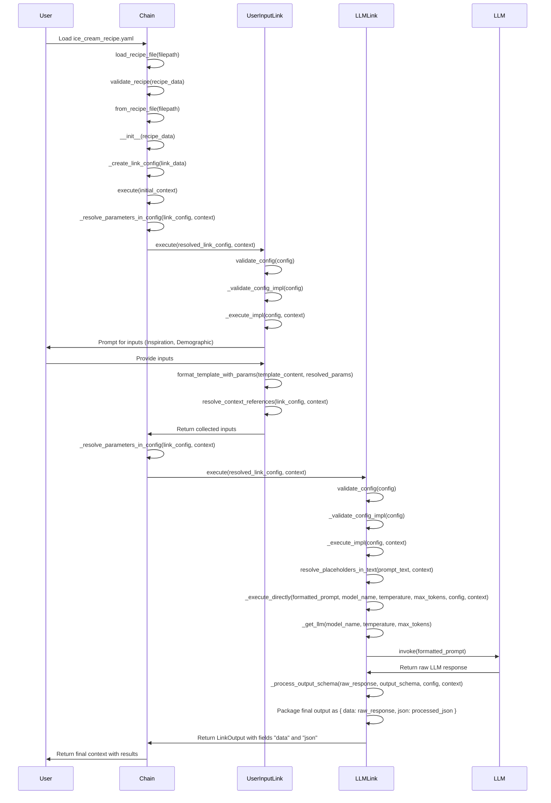

```mermaid
sequenceDiagram
    participant User
    participant Chain
    participant UserInputLink
    participant LLMLink
    participant LLM

    User->>Chain: Load ice_cream_recipe.yaml
    Chain->>Chain: load_recipe_file(filepath)
    Chain->>Chain: validate_recipe(recipe_data)
    Chain->>Chain: from_recipe_file(filepath)
    Chain->>Chain: __init__(recipe_data)
    Chain->>Chain: _create_link_config(link_data)
    Chain->>Chain: execute(initial_context)
    Chain->>Chain: _resolve_parameters_in_config(link_config, context)
    Chain->>UserInputLink: execute(resolved_link_config, context)
    UserInputLink->>UserInputLink: validate_config(config)
    UserInputLink->>UserInputLink: _validate_config_impl(config)
    UserInputLink->>UserInputLink: _execute_impl(config, context)
    UserInputLink->>User: Prompt for inputs (Inspiration, Demographic)
    User->>UserInputLink: Provide inputs
    UserInputLink->>UserInputLink: format_template_with_params(template_content, resolved_params)
    UserInputLink->>UserInputLink: resolve_context_references(link_config, context)
    UserInputLink->>Chain: Return collected inputs
    Chain->>Chain: _resolve_parameters_in_config(link_config, context)
    Chain->>LLMLink: execute(resolved_link_config, context)
    LLMLink->>LLMLink: validate_config(config)
    LLMLink->>LLMLink: _validate_config_impl(config)
    LLMLink->>LLMLink: _execute_impl(config, context)
    LLMLink->>LLMLink: resolve_placeholders_in_text(prompt_text, context)
    LLMLink->>LLMLink: _execute_directly(formatted_prompt, model_name, temperature, max_tokens, config, context)
    LLMLink->>LLMLink: _get_llm(model_name, temperature, max_tokens)
    LLMLink->>LLM: invoke(formatted_prompt)
    LLM->>LLMLink: Return raw LLM response
    LLMLink->>LLMLink: _process_output_schema(raw_response, output_schema, config, context)
    LLMLink->>LLMLink: Package final output as { data: raw_response, json: processed_json }
    LLMLink->>Chain: Return LinkOutput with fields "data" and "json"
    Chain->>User: Return final context with results
```
