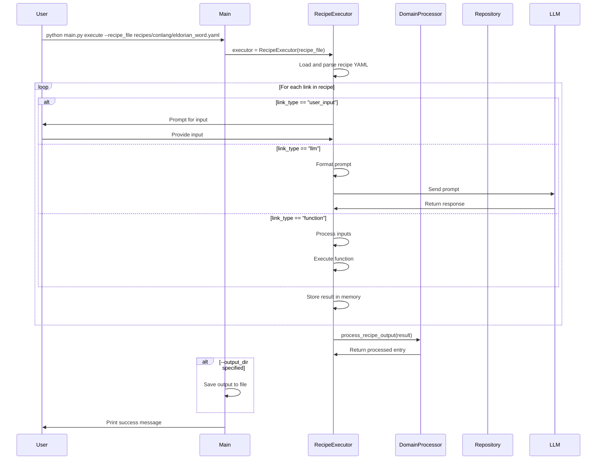

# Recipe Execution Sequence Diagram

This diagram illustrates the flow of execution when running the `execute` command. The RecipeExecutor processes each link in the recipe, which can be one of three types:

1. **user_input**: Prompts the user for input and stores the result
2. **llm**: Sends a prompt to an LLM model and processes the response
3. **function**: Executes a function with specified inputs

After all links are processed, the result is passed to a domain-specific processor to transform it into a domain-specific model or data structure. If an output directory is specified, the result is also saved to a file.
